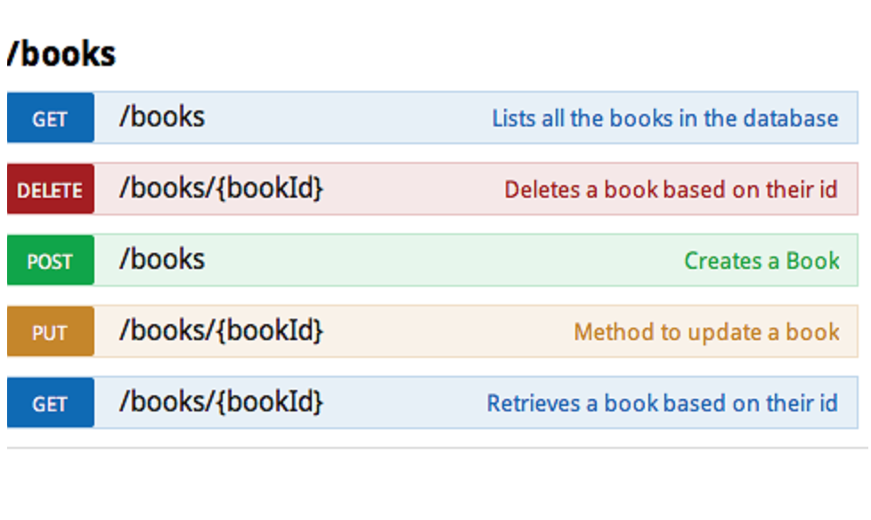

# api-js

## API Bilbao Weather

[https://my-json-server.typicode.com/jercilla/json-server-weather/cities/BIO](https://my-json-server.typicode.com/jercilla/json-server-weather/cities/BIO)

```
{
  "id": "BIO",
  "name": "Bilbao",
  "temperature": 11,
  "rain_probability": 0.9
}
```

# 1 Actualizar valores por javascript


```
<body>
  <div class="weather-summary">
    <h2 id="city_id">¿?</h2>
    
    <h3 id="temperature">¿? ºC</h3>
  </div>
  <script>
    document.getElementById('city_id').innerHTML = 'BIO';
    document.getElementById('temperature').innerHTML = '11 ºC';
    document.getElementById('weather_img').setAttribute('src', 'images/rain.png');
  </script>
</body>
```

# 2 Función load


```
  <script>
    function load() { 
      let city_id = 'BIO';
      let temperature = '11 ºC';
      let weather_img = 'images/rain.png';
      
      document.getElementById('city_id').innerHTML = city_id;
      document.getElementById('temperature').innerHTML = temperature;
      document.getElementById('weather_img').setAttribute('src', weather_img);
    }

    load();
  </script>
```

# 3 Llamada API (async/await)

```
  <script>
    async function load() {
      const url = 'https://my-json-server.typicode.com/jercilla/json-server-weather/cities/BIO'
      const response = await fetch(url)
      const data = await response.json()

      // console.log(data);
      // {
      //   "id": "BIO",
      //   "name": "Bilbao",
      //   "temperature": 11,
      //   "rain_probability": 0.9
      // }

      let city_id = data.id;
      let temperature = data.temperature;
      let weather_img = 'images/rain.png';
      
      document.getElementById('city_id').innerHTML = city_id;
      document.getElementById('temperature').innerHTML = temperature;
      document.getElementById('weather_img').setAttribute('src', weather_img);
    }

    load();
  </script>
```

## Ejercicio 

Poner `rain.png` si `rain_probability` es mayor qué `0.5`. 
Poner `sunny.png` si `rain_probability` es mayor <= `0.5`. 


# 4 Llamada API (then)

```
  <script>
    function load() {
      const url = 'https://my-json-server.typicode.com/jercilla/json-server-weather/cities/BIO'

      // const response = await fetch(url)
      // const data = await response.json()
      fetch(url)
        .then((response) => {
          return response.json()
        })
        .then((data) => {
          // console.log(data);
          let city_id = data.id;
          let temperature = data.temperature;
          let weather_img = 'images/rain.png';
          
          document.getElementById('city_id').innerHTML = city_id;
          document.getElementById('temperature').innerHTML = temperature;
          document.getElementById('weather_img').setAttribute('src', weather_img);
        })    
    }

    load();
  </script>
```


# 5 gestión de errores


```
  async function load() {
    const url = 'https://my-json-server.typicode.com/jercilla/json-server-weather/cities/BIO'
    
    const response = await fetch(url)
    
    if (response.ok) {
      ...
      ...
    } else {
      showError();
    }
  }
```


# 6 Métodos de petición HTTP (aka 'http verbs')



https://developer.mozilla.org/es/docs/Web/HTTP/Methods


# 7 REST

https://es.wikipedia.org/wiki/Transferencia_de_Estado_Representacional

> En REST, al contrario, el énfasis se pone en los recursos, o **sustantivos**; especialmente en los nombres que se le asigna a cada tipo de recurso. Por ejemplo, una aplicación REST podría definir algunos tipos de recursos asignándoles estos nombres:
>
>  - Libros
>  - Ciudades
>  - Usuarios
>  - ...

